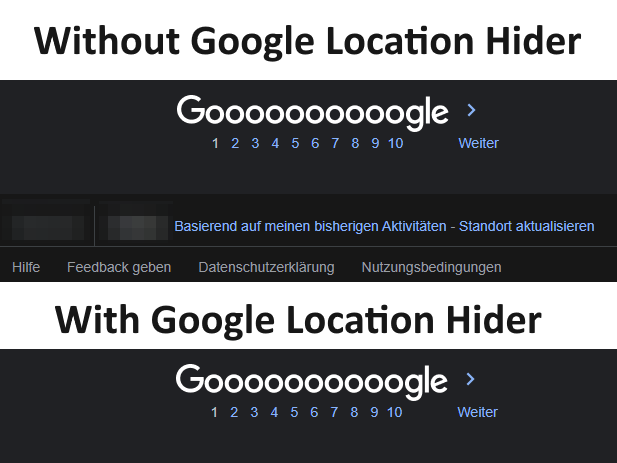

<h1 align="center">GoogleLocationHider</h1>

A script that hides your location when you use Google. (Tampermonkey Script / Browser Extension)

    
      
    
    
     
    
    

## Usage
1. Download the [google_location_hider.js](https://github.com/Lyzev/GoogleLocationHider/releases/latest) file
2. Open Tampermonkey in your Browser
3. Go to the Utilities tab
4. Press the button 'Choose File' at 'Import from file'
5. Choose the downloaded [google_location_hider.js](https://github.com/Lyzev/GoogleLocationHider/releases/latest) file
6. Click on install in the tab that has opened
7. Have fun!

## Example

## Bugs and Suggestions

### Discord
If you need support, you can join [this](https://discord.gg/5UmsQP4MFH) Discord server.

### GitHub
Bug reports and suggestions should be made in this repo's [issue tracker](https://github.com/Lyzev/GoogleLocationHider/issues) using the templates provided. Please provide as much information as you can to best help us understand your issue and give a better chance of it being resolved.

## Important
The idea for this project came from a friend of mine. (If he wants to be mentioned in this repo, contact me on Discord).
