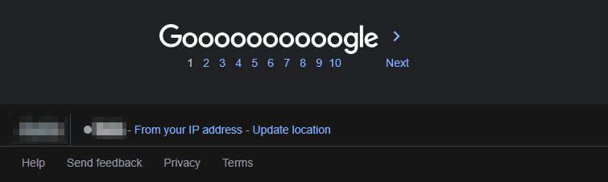

    

<h1 align="center">Google Location Hider</h1>

A script that hides your location when you use Google. (Tampermonkey Script / Browser Extension)

    
      
    
    
     
    
    

## Installation

### Chrome Extension
1. Download the [google-location-hider.zip](https://github.com/Lyzev/google-location-hider/releases/latest) file
2. Unzip the file
3. Open Chrome
4. Go to `chrome://extensions/`
5. Enable `Developer mode` in the top right corner
6. Press the button `Load unpacked` in the top left corner
7. Choose the unzipped folder
8. Have fun!

### Tampermonkey
1. Download the [google-location-hider.js](https://github.com/Lyzev/google-location-hider/releases/latest) file
2. Open Tampermonkey in your Browser
3. Go to the Utilities tab
4. Press the button `Choose File` at `Import from file`
5. Choose the downloaded [google-location-hider.js](https://github.com/Lyzev/google-location-hider/releases/latest) file
6. Click on `Install` in the tab that has opened
7. Have fun!

## Showcase

### Without

### With

## Bugs and Suggestions

### Discord
If you need support, you can join [this](https://discord.gg/5UmsQP4MFH) Discord server.

### GitHub
Bug reports and suggestions should be made in this repo's [issue tracker](https://github.com/Lyzev/google-location-hider/issues) using the templates provided. Please provide as much information as you can to best help us understand your issue and give a better chance of it being resolved.

## Important
The idea for this project came from a friend of mine. (If he wants to be mentioned in this repo, contact me on Discord).
